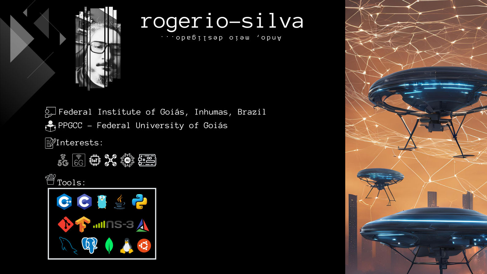

### Summary:

This repository is a playground for network enthusiasts where LoRaWAN, UAVs, and ns-3 simulations come together for some serious tech fun. Creations like "lorawan-gym" and "sliced-ns3-lorawan-module" aim to improve IoT networks and enhance the quality of service in complex simulations. The repository also delves deep into 5G and explores the use of UAVs as LoRaWAN gateways, pushing the boundaries of wireless networks and IoT research. Additionally, you can find class content, programming tips, scripts, and more for good measure!

### Connect with me:

<!--
 

<map name="map-rect">
    <area shape="rect" coords="18,26,220,226"
        href="https://www.geeksforgeeks.org"/>
</map>

<h1 align="center">Hi 👋, I'm Rogério</h1>
<h5 align="center">... always under development ...</h5>

---

👨‍🏫 Professor at [Federal Institute of Goiás, Inhumas, Brazil](https://www.ifg.edu.br/inhumas)

🎒 Ph.D. student in Computer Science at [PPGCC - Federal University of Goiás](https://ppgcc.inf.ufg.br/)

- 🔭 I’m currently working on **Dynamic resources allocation in non-3GPP IoT networks involving UAVs**

- 🌱 I’m always trying to learn something

- 📝 I regularly write articles on
  -   Future networks [1🌟](https://ieeexplore.ieee.org/stamp/stamp.jsp?tp=&arnumber=10207841), [2](https://sol.sbc.org.br/index.php/w6g/article/view/24665/24486), [3](http://editora.ifpb.edu.br/ifpb/catalog/view/401/209/1168-2)
  -   IoT - non3GPP [1](https://sol.sbc.org.br/index.php/erigo/article/view/18443/18276)
  -   UAV-based communications[1🌟](https://ieeexplore.ieee.org/document/10199941)
  -   Network Intelligence[1](https://sol.sbc.org.br/index.php/w6g/article/view/24660/24481), [2](https://sol.sbc.org.br/index.php/w6g/article/view/17230/17068)

- 📫 How to reach me:
  -   Professional: **rogerio.sousa@ifg.edu.br**
  -   Personal: **rogeriosousaesilva@gmail.com**

### Summary:

Esse repositório reúne projetos focados na simulação e integração de redes, com destaque para LoRaWAN, UAVs e o simulador ns-3. Desenvolvimentos como os módulos "lorawan-gym" e "sliced-ns3-lorawan-module" são direcionados à otimização de redes IoT e à melhoria da Qualidade de Serviço (QoS) em ambientes de simulação complexos. Esses trabalhos também exploram o uso de 5G e UAVs como gateways LoRaWAN, contribuindo para a inovação e pesquisa em redes sem fio e IoT.

### Languages and Tools:

-->

