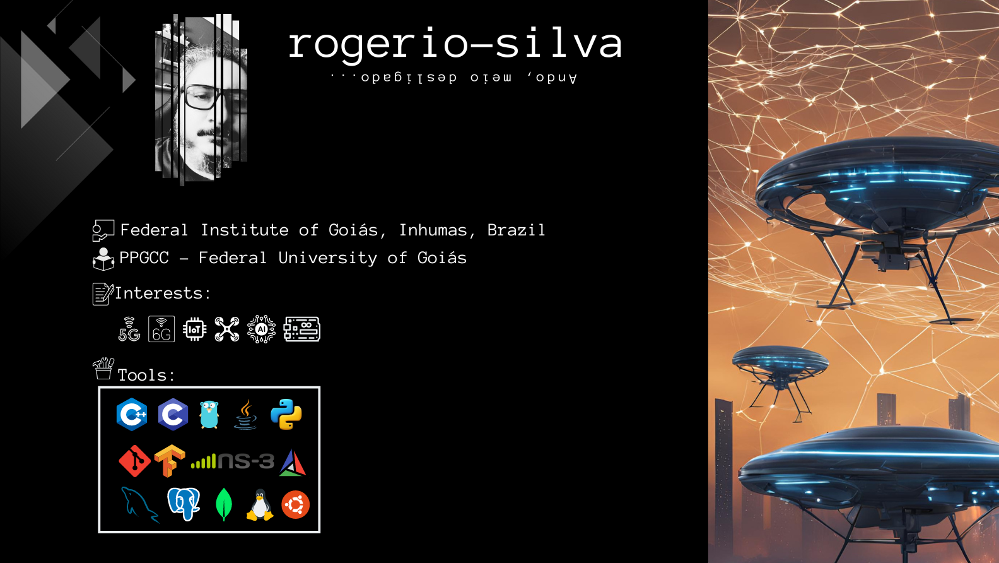

# Olá, eu sou o Rogério 👋

**Professor no [IFG – Câmpus Inhumas](https://www.ifg.edu.br/inhumas)** · **Doutorando em Ciência da Computação no [PPGCC/UFG](https://ppgcc.inf.ufg.br/)** · Pesquisador no **NumbERS Lab**

---

## 🔬 Pesquisa

Trabalho com **alocação dinâmica de recursos em redes IoT não-3GPP envolvendo VANTs**: uso de drones como *gateways* LoRaWAN móveis, com foco em Qualidade de Serviço. Na prática, isso junta LoRaWAN, redes 5G/6G, aprendizado por reforço profundo e simulação em **ns-3**.

| Repositório | O que é |
|---|---|
| [`A2C-LoVQI`](https://github.com/rogerio-silva/A2C-LoVQI) | Aprendizado por reforço profundo para posicionar VANTs como gateways LoRaWAN (artigo SBrT 2024) |
| [`sliced-ns3-lorawan-module`](https://github.com/rogerio-silva/sliced-ns3-lorawan-module) | Módulo LoRaWAN do ns-3 estendido com suporte a *network slicing* |
| [`lorawan-gym`](https://github.com/rogerio-silva/lorawan-gym) | Cenários de simulação integrando ns-3, OpenAI Gym, LoRaWAN e NR-5G |
| [`non3GPP_IoT_simulations`](https://github.com/rogerio-silva/non3GPP_IoT_simulations) | Simulações e datasets do artigo *Dynamic resources allocation in non-3GPP IoT networks involving UAVs* |
| [`lorawan-class-c`](https://github.com/rogerio-silva/lorawan-class-c) | Implementação de dispositivos finais Classe C no módulo LoRaWAN do ns-3 |
| [`density-dev-distrib`](https://github.com/rogerio-silva/density-dev-distrib) | Distribuição de dispositivos IoT orientada por densidade |

## 📝 Publicações selecionadas

- 🌟 **Redes futuras** — [IEEE (2023)](https://ieeexplore.ieee.org/document/10207841) · [SBC W6G](https://sol.sbc.org.br/index.php/w6g/article/view/24665/24486) · [Editora IFPB](http://editora.ifpb.edu.br/ifpb/catalog/view/401/209/1168-2)
- 🌟 **Comunicações baseadas em VANTs** — [IEEE (2023)](https://ieeexplore.ieee.org/document/10199941)
- **IoT não-3GPP** — [SBC ERIGO](https://sol.sbc.org.br/index.php/erigo/article/view/18443/18276)
- **Inteligência de rede** — [SBC W6G (2023)](https://sol.sbc.org.br/index.php/w6g/article/view/24660/24481) · [SBC W6G (2021)](https://sol.sbc.org.br/index.php/w6g/article/view/17230/17068)

## 👨‍🏫 Material de aula

Boa parte deste perfil é material de apoio para as disciplinas do IFG — sinta-se à vontade para usar.

- **C / C++** — [`c_yt_course`](https://github.com/rogerio-silva/c_yt_course) · [`aula-C-20250220`](https://github.com/rogerio-silva/aula-C-20250220)
- **Java e POO** — [`MeAu_PET`](https://github.com/rogerio-silva/MeAu_PET) · [`java-crud`](https://github.com/rogerio-silva/java-crud) · [`java-web-servlet`](https://github.com/rogerio-silva/java-web-servlet) · [`aula_Springboot_Flyway`](https://github.com/rogerio-silva/aula_Springboot_Flyway)
- **Redes** — [`aula_instalando_ns3`](https://github.com/rogerio-silva/aula_instalando_ns3) · [`sockets-computer-networking`](https://github.com/rogerio-silva/sockets-computer-networking)
- **Ferramentas** — [`git-basico`](https://github.com/rogerio-silva/git-basico) · [`update-ubuntu`](https://github.com/rogerio-silva/update-ubuntu)

🇬🇧 <b>In English</b>

 

I'm a professor at the Federal Institute of Goiás (IFG), Inhumas campus, and a Ph.D. student in Computer Science at the Federal University of Goiás (UFG), with the NumbERS Lab.

My research addresses **dynamic resource allocation in non-3GPP IoT networks involving UAVs** — using drones as mobile LoRaWAN gateways with a focus on Quality of Service. It brings together LoRaWAN, 5G/6G networks, deep reinforcement learning and ns-3 simulation. Projects such as `lorawan-gym` and `sliced-ns3-lorawan-module` aim to improve IoT networks and QoS in complex simulation scenarios.

Alongside the research work, this profile hosts teaching material — class content, programming tips and scripts — used in my courses at IFG.

## 🧰 Ferramentas do dia a dia

## 📊 Estatísticas

<picture>
  <source media="(prefers-color-scheme: dark)" srcset="https://streak-stats.demolab.com/?user=rogerio-silva&locale=pt_BR&theme=tokyonight&hide_border=true">
  
</picture>

<picture>
  <source media="(prefers-color-scheme: dark)" srcset="https://github-readme-activity-graph.vercel.app/graph?username=rogerio-silva&theme=tokyo-night&hide_border=true&days=90">
  
</picture>

<!--
  CARDS DO github-readme-stats — DESATIVADOS.
  A instância pública (github-readme-stats.vercel.app) está com o deployment PAUSADO
  (HTTP 503 / DEPLOYMENT_PAUSED), então estes cards apareceriam quebrados.
  Para reativá-los, faça fork de https://github.com/anuraghazra/github-readme-stats,
  faça deploy próprio na Vercel (grátis, com um PAT em PAT_1) e troque o domínio abaixo.

<picture>
  <source media="(prefers-color-scheme: dark)" srcset="https://SEU-DEPLOY.vercel.app/api?username=rogerio-silva&show_icons=true&rank_icon=github&locale=pt-br&theme=tokyonight&hide_border=true">
  
</picture>

<picture>
  <source media="(prefers-color-scheme: dark)" srcset="https://SEU-DEPLOY.vercel.app/api/top-langs/?username=rogerio-silva&layout=compact&langs_count=8&locale=pt-br&theme=tokyonight&hide_border=true">
  
</picture>

-->

<!--
  Regenerado por Action, se quiser: Platane/snk (snake do gráfico de contribuições).
-->

## 🤝 Onde me encontrar

<!--
=====================================================================
ARQUIVO HISTÓRICO — versões anteriores deste perfil. Não apagar.
=====================================================================

<map name="map-rect">
    <area shape="rect" coords="18,26,220,226"
        href="https://www.geeksforgeeks.org"/>
</map>

<h1 align="center">Hi 👋, I'm Rogério</h1>
<h5 align="center">... always under development ...</h5>

---

👨‍🏫 Professor at [Federal Institute of Goiás, Inhumas, Brazil](https://www.ifg.edu.br/inhumas)

🎒 Ph.D. student in Computer Science at [PPGCC - Federal University of Goiás](https://ppgcc.inf.ufg.br/)

- 🔭 I’m currently working on **Dynamic resources allocation in non-3GPP IoT networks involving UAVs**

- 🌱 I’m always trying to learn something

- 📝 I regularly write articles on
  -   Future networks [1🌟](https://ieeexplore.ieee.org/stamp/stamp.jsp?tp=&arnumber=10207841), [2](https://sol.sbc.org.br/index.php/w6g/article/view/24665/24486), [3](http://editora.ifpb.edu.br/ifpb/catalog/view/401/209/1168-2)
  -   IoT - non3GPP [1](https://sol.sbc.org.br/index.php/erigo/article/view/18443/18276)
  -   UAV-based communications[1🌟](https://ieeexplore.ieee.org/document/10199941)
  -   Network Intelligence[1](https://sol.sbc.org.br/index.php/w6g/article/view/24660/24481), [2](https://sol.sbc.org.br/index.php/w6g/article/view/17230/17068)

- 📫 How to reach me:
  -   Professional: **rogerio.sousa@ifg.edu.br**
  -   Personal: **rogeriosousaesilva@gmail.com**

### Summary:

Esse repositório reúne projetos focados na simulação e integração de redes, com destaque para LoRaWAN, UAVs e o simulador ns-3. Desenvolvimentos como os módulos "lorawan-gym" e "sliced-ns3-lorawan-module" são direcionados à otimização de redes IoT e à melhoria da Qualidade de Serviço (QoS) em ambientes de simulação complexos. Esses trabalhos também exploram o uso de 5G e UAVs como gateways LoRaWAN, contribuindo para a inovação e pesquisa em redes sem fio e IoT.

### Languages and Tools:

-->
